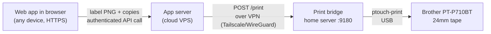

# P-Touch Cube Network Print Bridge

Turn a **Brother PT-P710BT (P-Touch Cube Plus)** — a Bluetooth/USB label printer designed
for Brother's mobile app — into a **networked label printer** that any web app can print
to with one click, from any device, anywhere.

This repo documents a working architecture plus the code to reproduce it: a tiny HTTP
print bridge that runs on a home server with the printer permanently wired over USB,
and the client/server snippets that let a self-hosted web application (in my case a home
inventory system) render labels in the browser and print them over the network.



## Why this shape?

- **The printer is Bluetooth-first by design.** Brother's intended flow is phone →
  Bluetooth → printer via their app. That's fine for ad-hoc use but hopeless for a web
  app that wants one-click printing. The PT-P710BT (unlike the smaller PT-P300BT) also
  has a **USB port** — and USB + Linux is far more reliable than scripting Bluetooth
  Classic on a headless box. So: wire it permanently to an always-on home server.
- **The browser can't talk to the bridge directly.** If your app is served over HTTPS,
  the browser will block a call to `http://10.0.0.x:9180` as mixed content (only
  `127.0.0.1` is exempt). The fix is one server-side hop: the app's backend proxies
  print requests to the bridge over a VPN (Tailscale in my setup). Bonus: printing now
  works from your phone on mobile data, and the bridge inherits whatever auth your app
  already has.
- **Labels are rendered client-side to a `<canvas>`.** The preview in the print dialog
  *is* the exact bitmap that gets printed — no server-side rendering, no WYSIWYG drift.
  The app sends a PNG data URL; the bridge scales it to the loaded tape and prints.

## Components

| Path | What it is |
|---|---|
| [`bridge/bridge.py`](bridge/bridge.py) | Stdlib-only Python HTTP bridge: `GET /health`, `POST /print`. Wraps `ptouch-print`, scales the PNG to the tape's printable height, prints one job per copy so the auto-cutter separates labels. Serialises jobs under a lock, waits for the physical print to settle before verifying, and runs an optional keepalive probe that reports reachability in `/health` without touching the bus mid-job. |
| [`bridge/ptouch-print-bridge.service`](bridge/ptouch-print-bridge.service) | systemd unit to keep it running. |
| [`patches/ptouch-print-p710bt-init.patch`](patches/ptouch-print-p710bt-init.patch) | **Required** one-line fix for `ptouch-print`: the PT-P710BT needs the P700-family init sequence; without it every job silently fails with a media error. |
| [`snippets/render-label.ts`](snippets/render-label.ts) | Browser-side label renderer: tape presets, QR code + big readable ID + item name with adaptive font shrinking/wrapping for long names. |
| [`snippets/proxy-endpoint.ts`](snippets/proxy-endpoint.ts) | Example server proxy endpoints (Nitro/h3 style, trivially portable to Express) between the HTTPS app and the bridge. |
| [`docs/hardware-notes.md`](docs/hardware-notes.md) | Everything I learned the hard way: error codes, the blank-leader problem and `--precut`, auto power-off behaviour, print head geometry. |
| [`docs/windows-config-vm.md`](docs/windows-config-vm.md) | Killing auto power-off for good, from a headless Linux host: building a Windows ISO with UUP dump, an on-demand KVM guest, and USB passthrough of the printer. |
| [`docs/cups-evaluation.md`](docs/cups-evaluation.md) | Why the bridge owns the device instead of feeding through a CUPS queue, what a P710BT CUPS driver would actually give you, and the inverted design to use if you want a generic queue anyway. |
| [`scripts/win-utility.sh`](scripts/win-utility.sh) | `up` / `down` / `view` / `printer-attach` / `printer-detach` wrapper for that VM. |

## Setup (bridge host)

```bash
# 1. Build ptouch-print with the P710BT init patch
sudo apt install gcc cmake make pkg-config libusb-1.0-0-dev libgd-dev gettext python3-pil
git clone https://git.familie-radermacher.ch/linux/ptouch-print.git
cd ptouch-print
git apply /path/to/patches/ptouch-print-p710bt-init.patch
cmake -B build -DCMAKE_BUILD_TYPE=Release && cmake --build build
sudo cp build/ptouch-print /usr/local/bin/
sudo cp udev/*.rules /etc/udev/rules.d/   # USB permissions for 04f9:20af
sudo udevadm control --reload-rules && sudo udevadm trigger

# 2. Sanity check — printer plugged in via USB and powered on
ptouch-print --info    # should report tape width and "error = 0x0000"

# 3. Install the bridge
mkdir -p ~/print-bridge && cp bridge/bridge.py ~/print-bridge/
sudo cp bridge/ptouch-print-bridge.service /etc/systemd/system/   # edit User= and path first
sudo systemctl enable --now ptouch-print-bridge

# 4. Test
curl -s http://127.0.0.1:9180/health
# {"ok": true, "printer": "PT-P710BT", "tapeMm": 24, "maxPx": 128}
```

Printing directly (no app involved):

```bash
python3 - <<'EOF'
import base64, json, urllib.request
png = open("label.png", "rb").read()   # landscape PNG, black on white
body = json.dumps({"imageDataUrl": "data:image/png;base64," + base64.b64encode(png).decode(),
                   "copies": 1}).encode()
req = urllib.request.Request("http://127.0.0.1:9180/print", body,
                             {"Content-Type": "application/json"})
print(urllib.request.urlopen(req, timeout=90).read().decode())
EOF
```

## Wiring it into your app

1. Put the bridge host and your app server on the same VPN (Tailscale, WireGuard, …).
2. Add the two proxy endpoints from `snippets/proxy-endpoint.ts` to your backend and
   point `PRINT_BRIDGE_URL` at the bridge's VPN address.
3. In your print dialog, probe `GET /api/print/bridge-health` when it opens; if
   `available`, show a **Print** button that POSTs the rendered canvas PNG. Keep
   Web Share (→ Brother's app) and Download as fallbacks for when the printer is off.

## Security notes

- The bridge itself has **no auth** — bind it to a trusted LAN/VPN only. All external
  access should come through your app's authenticated proxy.
- The proxy validates the payload shape and caps copies; the bridge additionally caps
  body size and serializes jobs with a lock.

## License

MIT — see [LICENSE](LICENSE). `ptouch-print` itself is GPL-3.0 (separate project,
patched but not vendored here).
